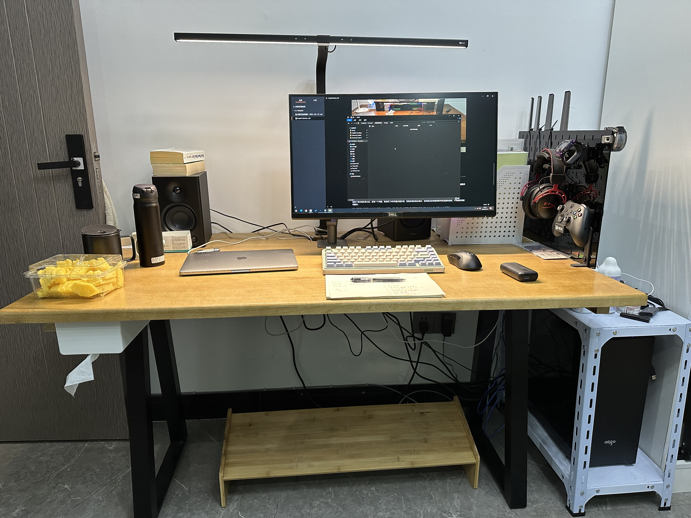
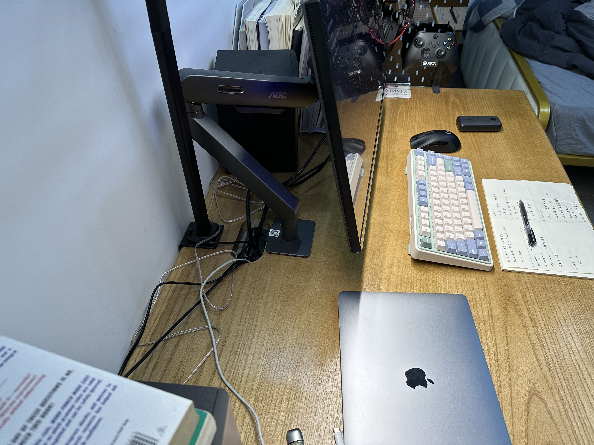
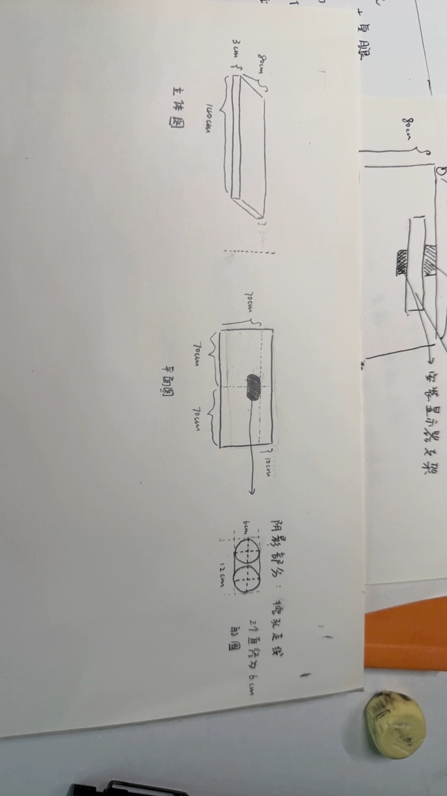
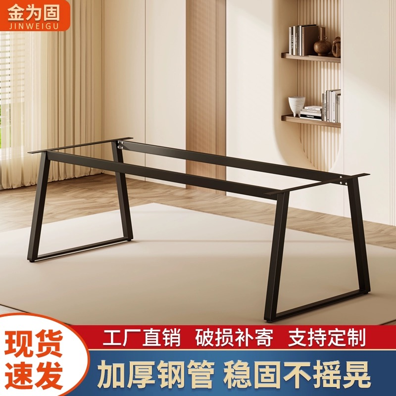

# 电脑桌面定制指南 V2

2024-04-13 更新

更换了工作之后我重新定制了一张桌子。

如下图所示

其侧面结构为

其设计结构图如下所示

结果发现留下10cm的空隙好像不够显示器支架旋转会卡到台灯。

目前解决方案有

- 加大这个空隙，
- 或者将台灯卡到天花板上

不让其占用后面的空间。

## 桌腿的选择

如下图所示，选择小了一号，然后让桌腿中间的横梁靠近桌面后半部分靠墙的地方。这样子就不会卡到大腿

# 桌下理线器

关于桌面下面的理线部分，参考这个视频：

[不到百元的完美桌面理线方案，你不来了解下？_哔哩哔哩_bilibili](https://www.bilibili.com/video/BV1zP4y1T7RS/?spm_id_from=333.999.0.0&vd_source=617c4a2b4e326fc6b6269aada0d25986)
